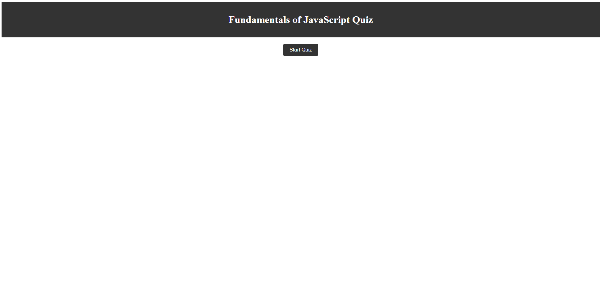

# <Challenge#4: Creating a Quiz>

## Description
<li>Created a Quiz using HTML, CSS and JavaScript
<li>Created a 120second timer to keep track of how long it takes the user to compelte the quiz
<li>Learned more about how to hide things behind buttons in HTML and JavaScript
<li>Learned how to create a scoreboard within HTML

## Installation

<li>For this installation all you have to do is take the quiz and see the magic for yourself! To learn more about how it was made you can look at the source code in the repo linked down below!

## Usage

 Users are able to test their funamental knowledge of JavaScript while also comparing their scores to their peers!

# Screenshot 

---
# <Link to Repo with Source Code!>

https://github.com/diazgus411/Chall4
